# Mapping Homelessness in San Diego Downtown

#### Arnav Dagar
#### Arnav.Dagar.sd@gmail.com
#### July 10th, 2025

&nbsp;

This project converts San Diego Downtown Homeless Survey data into GIS format. Since 2015, Downtown San Diego Partnership [(DSDP)](https://downtownsandiego.org/clean-and-safe/unhoused-care/) has been conducting an observational count of the unsheltered homeless in Downtown San Diego on paper maps. DSDP manually annotates te counts, tallies the results and uploads pdf of the scans of the paper maps with tabulated data on their website. This project uses computer vision and deep learning methods to read count information from paper maps, geotag and map the counts on a GIS map for each month for all the 10 regions of downtown San Diego for further visualization and analysis.

## 1. Raw Data

### a) Template Maps
The Downtown San Diego Partnership provided the 10 template map images that they
use for counting. These are essentially empty maps that they print and use for the count every
month. These maps span different regions of downtown that DSDP serves – East Village
(EV), East Village South (EVS), Sherman Heights (SH), Golden Hills (GH), Gaslamp (GL),
Barrio Logan (BL), Cortez (TZ), City Center (CC) and Columbia (CO).

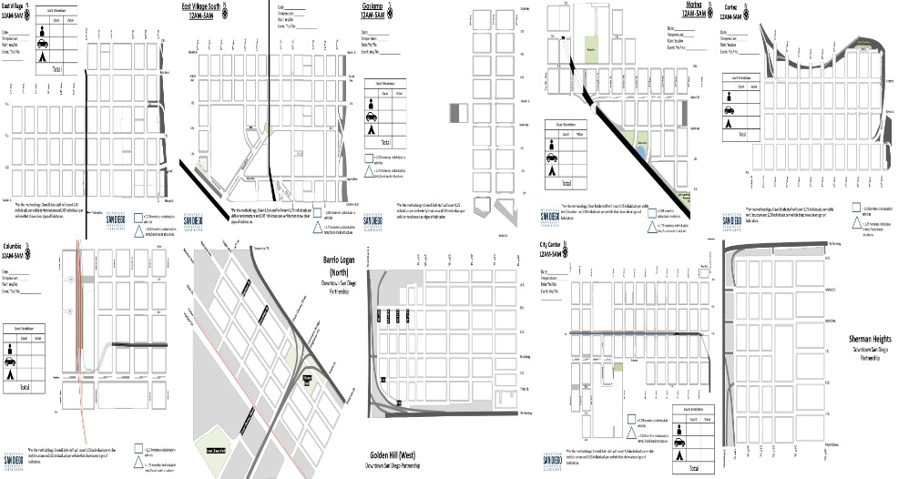 

### b) Data Maps
I downloaded monthly count map data pdfs from 2018 to Jan 2025 from the DSDP
website and converted into jpgs. Here is a sample from the 2024 Dec data collection - 10 for each month.

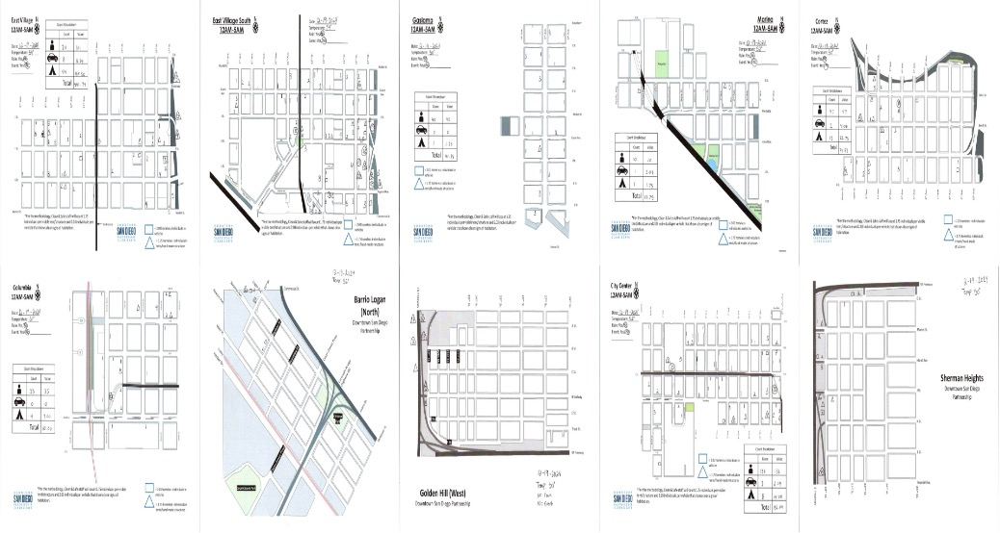 

DSDP capture different count information using symbols and digits. Below images show
samples of the count data. They are zoomed out significantly to be visible. Count information
includes individuals, tents and vehicles.

Individual counts are shown as either signle digit numbers or when 10 or more people are
obsevred, a circle is marked around the number to indicate a double digit number. Vechicels are
shown with a rectangle symbol with count of vehciles included in the symbol. Similarly tents are
shown with triangular symbols and have count of tents included in the symbol. Figures below
show some samples.

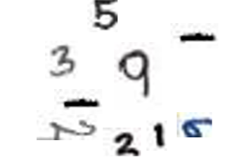 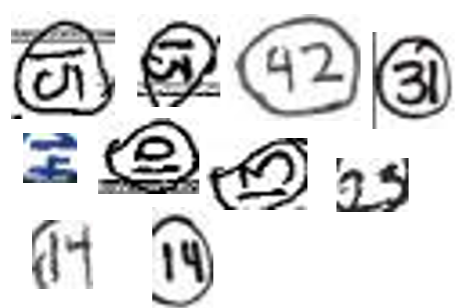 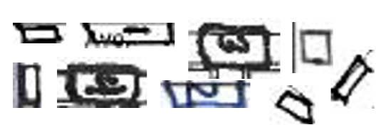 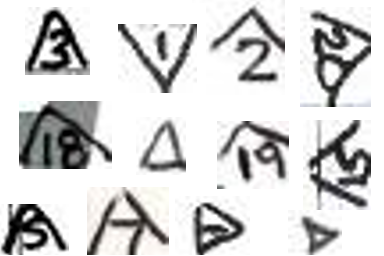 

## 2. Preparing Template Maps – one time process.
 
We use template maps to identify key information present on the maps – legends, symbols,
tallied data, map region, 4 Ground Control Points (GCPs) in Image Pixel Coordinates (IPC),
Information Outside Map Neat Lines (IOMNL). I annotated 10 Template Maps (TMs) in
Roboflow with Bounding Boxes (BBs) for Map Title, 4 GCPs, IOMNL, Polygons for map,
Polygons for shade map region. A sample annotated map is shown below. It shows Template with Neat Lines (Purple), 
IOMNLs (Cyan), GCPs (4 intersections in red green, blue and orange) annotated
manually in roboflow

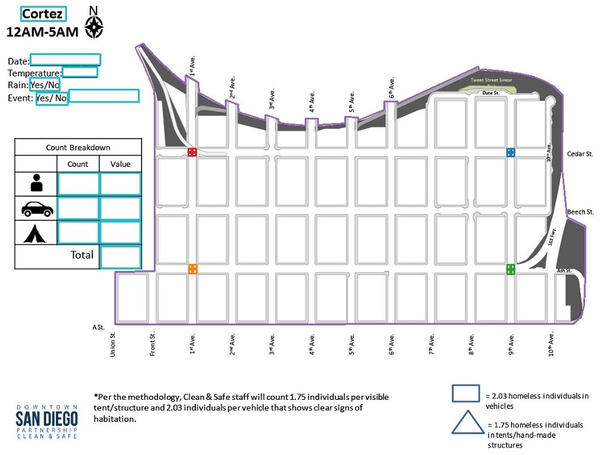 

Thus from roboflow I get the following 55 identifying classes corresponding to the 10 template maps. These class identifiers are stored in a yaml file for use in the program to process the data maps.

    nc: 55
    names: ['CC', 'CV', 'Date-Field', 'Event-Field', 'Event-Field-2',
    'GCP0_BL', 'GCP0_CC', 'GCP0_CO', 'GCP0_EV', 'GCP0_EVS', 'GCP0_GH',
    'GCP0_GL', 'GCP0_M', 'GCP0_SH', 'GCP0_TZ', 'GCP1_BL', 'GCP1_CC',
    'GCP1_CO', 'GCP1_EV', 'GCP1_EVS', 'GCP1_GH', 'GCP1_GL', 'GCP1_M',
    'GCP1_SH', 'GCP1_TZ', 'GCP2_BL', 'GCP2_CC', 'GCP2_CO', 'GCP2_EV',
    'GCP2_EVS', 'GCP2_GH', 'GCP2_GL', 'GCP2_M', 'GCP2_SH', 'GCP2_TZ',
    'GCP3_BL', 'GCP3_CC', 'GCP3_CO', 'GCP3_EV', 'GCP3_EVS', 'GCP3_GH',
    'GCP3_GL', 'GCP3_M', 'GCP3_SH', 'GCP3_TZ', 'IC', 'IV', 'Rain-Field',
    'Shaded', 'TC', 'TV', 'Temperature-Field', 'Title', 'Total', 'map']

    nC = number of classes
    ‘CC’, ‘CO’,’EV’,’EVS’, ‘TZ’, ‘BL’,’M’,’GL’,’GH’, ‘SH’ correspond to the 10 regions – City Center, Columbia, East 
    Village, East Village South, Cortez, Barrio Logan, Marina, Gaslamp,Golden Hills, and Sherrman Heights respectively. 
    There are 4 GCPs (GCP0-3) for each region. Rest of the items correspond to different fields within the map
For the each template map, roboflow also generated the bounding box or polygon pixel
coordinates for each of the classes pertinent to the map. This is stored in a text file. The first
number is the class from the list above followed by the normalized pixel y,x coordinates.

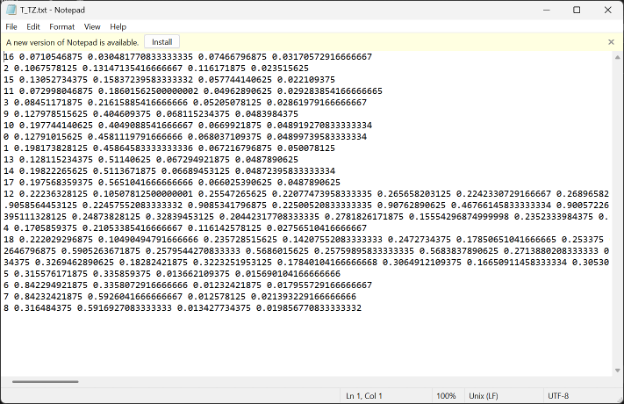 

The 4 GCPs are easily identifiable intersections on the map. I looked up their
corresponding latitude longitude coordinates in Google maps and created a xls file (Link to
Latest_gcp.xlx). Below is a sample of the information from the file. GCPs 0-3 are used for
converting image pixel coordinates into latitude longitude coordinates. -1, 4 are used to identify
the maximum area covered by the map. In the table Geo corresponds to one of 10 geo regions.
GCP id 0- 3 corresponds to 4 intersections on the map. -1 and 4 are used to identify the corners of
the rectangle defining the region. gcpY and gcpX are the latitude and longitude respectively.

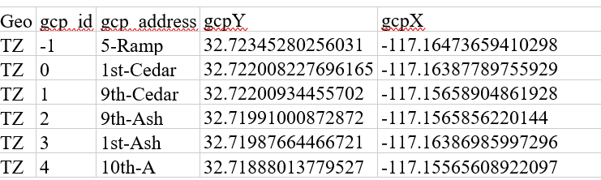 

## 3.	Aligning Data Maps and Geo Tagging

Below steps outline the algorithm for aligning data map to template map images:
```
1. Resize Data Maps to Same Size As Template Maps 768x1024 or 1024x768 pixels
2. Convert Template Maps and Data Maps into Gray Images
3. Using SIFT Find Key Point and Descriptors for the Template and Data Map
4. Using a Brute Force Matcher find Descriptor Matches using KNNs (K=2)
5. Using the ratio test for distance, select a set of good Key Point matches between the Template and Data Map
6. Find the Homography Matrix, H, for the Matching Key Points for the Matching Template Map and Data Map using a RANSAC
    Algorithm
7. Using H Matrix transform the Data Map to Align it to the Matching Template Map
```
Images below illustrate the keypoint correspondences (1st set of images) and alignment (2nd set showing template and aligned data maps):

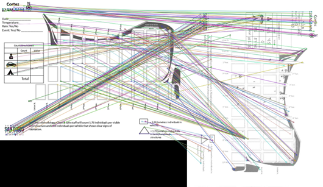  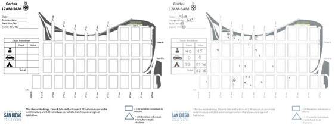 

Once we have an aligned data map, we can find the geo control points in Image Pixel Coordinates as shown in the figure below (same pixel coordinates)

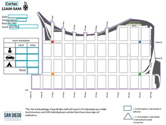  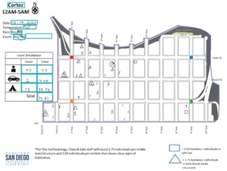 

Then using the corresponding GCPs in GIS Map Coordinates, we find transformation Matrix A to map Image Pixel Coordinates into GIS Map Coordinates. Using the matrix A we can map pixel coordinates onto a GIS Map as illustrated in the figure below:

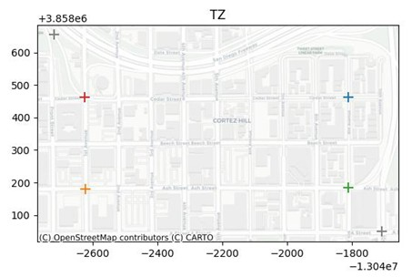  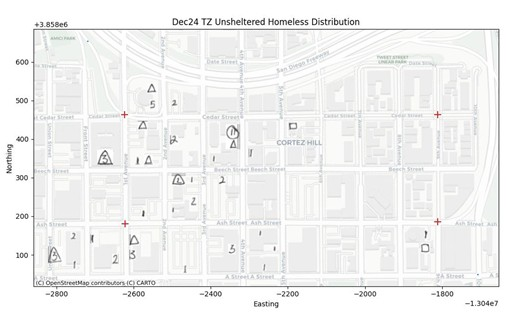 

## 4. Machine Learning models for count data

I have trained six multistage machine learning models in roboflow to read the count data and classify
it as Individual, Tent and Vehicle. Below steps, flowchart describes what the model do, what they were
trained on and the performance metrics of each of the models:
```
1. model_id: count-annotations-4/3 → Object detection (hand marked count data)
This model find bounding boxes for all of the hand marked counts – Individual Single Digit (SD), Individual Double Digit (DD),
Single Tent (ST), Multi Tent (MT). Single Vehicle (SV), Multi Vehicle (MV). This stage returns the center coordinates of bounding
box and its width and height (cx,cy,wx,wy)

2. model_id: digitclassification/2 → Single Digit Classification
This model is a digit classification model that identifies the image within the Single Digit bounding box as
0, 1, 2, 3, 4, 5, 6, 7, 8, 9

3. model_id : doubledigit/2 → Object detection (Digits)
A Double Digit Object Detection Model processes the image within the Double Digit bounding box and produces bounding boxes for the
Tens and Units digits. A digit classification model then classifies the Tens an Unit digit images to 0-9 and the tens and units
digits are combined to produce the count.

4. model_id: tent-classification/1 classifies the Tent bounding in three classes – Single Tent, Single
Digit Tent, Single Tent and Multi Digit Tent. The Single Tent bounding box is just a tent, while others have digits marked in them.

5. tentdigits-sd/1 gives bounding box for the digit within the tent symbol

6. dd-tdd/1 gives bounding boxes for the Unit and Tens digit within the tent symbol

```
Below tables provide more details on the input, output, type of models, training data used and
performance metric of each of the models.


| S.No. | Model ID | Type | Model Type | mAP50    | Precision    | Recall    | Accuracy    | Training Items    |
|:-----:|:---------:|:-----:|:-------------:|:---------:|:------------:|:---------:|:-----------:|:-------------------:|
| 1.    |count-annotations-4/3| Object Detection|YOLOV12-X| 92.4%| 88.7% |88.6%| N/A| 12664|
| 2.    |digitclassification/2| Classification |ViT| N/A| N/A| N/A| 97.2%| 6325|
| 3.    |dd-tdd/1| Object Detection|YOLOV12-X| 96.1%| 93.5%| 89.0%| N/A| 686|
| 4.    |tentdigits-sd/1| Object Detection|YOLOV12-X |92.7%| 89.9%| 88.9%| N/A |1104|
| 5.    |oubledigit/2| Object Detection|YOLOV12-X| 94.7%| 91.3%| 92.8%| N/A| 348|
| 6.    |tent-classification/1| Classification| ViT| N/A| N/A| N/A| 91.4%| 3020|

|S.No.| Model ID| Input |Output| Sample Input and Annotations|
|:-----:|:---------:|:-----:|:-------------:|:---------:|
|1.|count-annotations-4/3|Image of Data Map of A Region| Bounding Boxes of each count - Individual Single Digit (SD), Individual Double Digit (DD), Single Tent (ST), Multi Tent (MT). Single Vehicle (SV), Multi Vehicle (MV).| 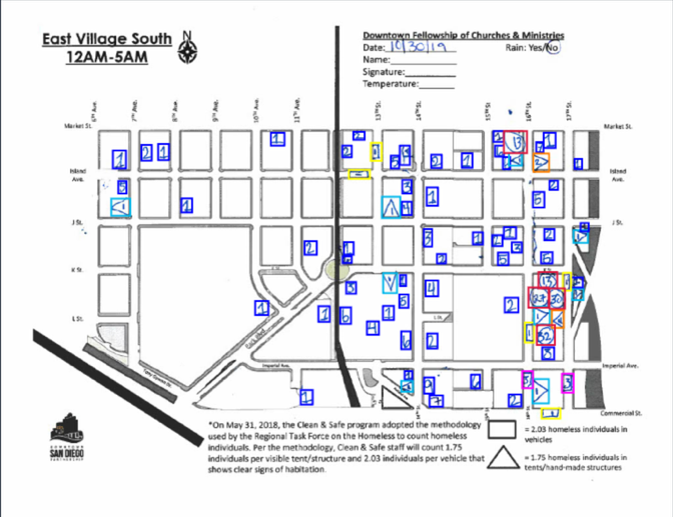|
|2.| digitclassification/2 | Image of A Single Digit| Digit Value 0,1,2,3,4,5,6,7,8,9|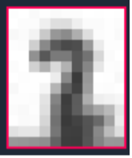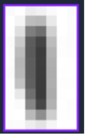|
|3.| dd-tdd/1| Image of A Double-Digit Tent|2 Bounding Boxes of Digits (Ten’s and Unit’s)|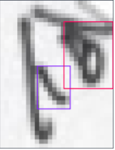|
|4.| tentdigits-sd/1| Image of A Single-Digit Tent| 1 Bonding Box of Digit|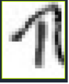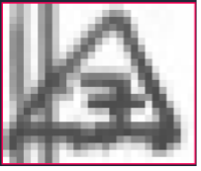|
|5.| doubledigit/2| Image of A Double Digit Number| 2 Bounding Boxes of Digits (Ten’s and Unit’s)|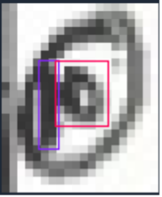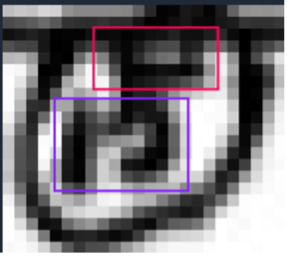|
|6.| tent-classification/1| Image of A Tent| One of 3 Classes: Single Tent, Single-Digit Tent, Double-Digit Tent|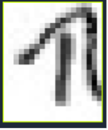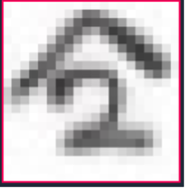 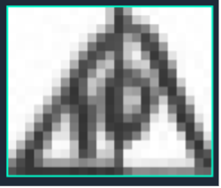|


Below flow chart shows how an input data map is processed with these 6 machine learning models.
Starting with a data map aligned to its template, we run object identification models to identify relevant
boundaries boxes and then either run classification or object detection models on relevant bounding box
images till we get a count information and one of 3 classes – Individual, Tent, Vehicle. 

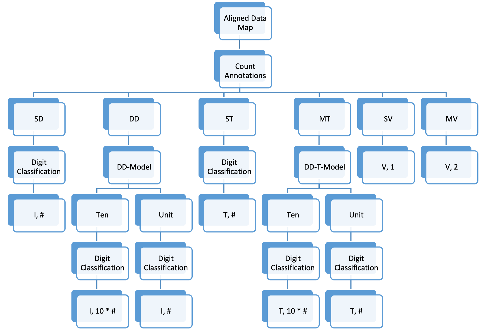

## 5. Program to process each month’s data maps

This section describes the python script used to process each month’s data maps. 
The code is contained in the jupyter notebook:
July_2025_MLBased_Homelessness_Report.ipynb

Copy this notebook and the other folder described below and modify first few lines of cell 4 to ensure that path for your structure is correct.
This notebook assumes the following directory structure (root directories and subdirectories).

#### PROJECT DIRECTORY STRUCTURE
```
/content/drive/MyDrive/
│
├── HomelessMappingFolder/
│   ├── Config/
│   │   ├── T_geo.txt                    # Template configuration text files
│   │   └── T_geo.yaml                   # Template configuration YAML files
│   │
│   ├── Results/
│   │   ├── yyyyMMM_homeless_count_data.csv    # Processed count data
│   │   ├── yyyyMMMgeobbInMap.jpg              # Bounding box visualizations per region
│   │   └── yyyyMMMDT.jpg                      # Downtown consolidated map
│   │
│   ├── Templates/
│   │   └── T_geo.jpg                    # Template images for each geographic region
│   │
│   └── LatestGCP.xlsx                   # Ground Control Points spreadsheet
│
└── Maps/
    └── yyyy/                            # Year folder (e.g., 2025)
        └── yyyy_MMM/                    # Month folder (e.g., 2025_MAY)
            ├── [Data Downloaded from DSDP website]
            └── geo.jpg                   # Converted PDF images for each region
                                         # (where geo = EV, EVS, GL, M, TZ, CO, BL, GH, CC, SH)
```
```
NOTES:

- yyyy = 4-digit year (e.g., 2025)
- MMM = 3-letter month abbreviation (e.g., MAY, JUN, JUL)
- geo = Geographic region code (10 regions total):
- EV: East Village
- EVS: East Village South
- GL: Gaslamp
- M: Marina
- TZ: Cortez
- CO: Colombia
- BL: Barrio Logan
- GH: Golden Hill
- CC: City Center
- SH: Sherman Heights

FILE DESCRIPTIONS:

- Config files: Template matching and annotation configurations
- Results: Processed data outputs and visualization maps
- Templates: Reference images for image alignment
- LatestGCP.xlsx: Geographic coordinate reference points
- Maps: Source imagery organized by year and month
```

The HomelessMappingFolder has a Config, Results and Template folder. The Config folder
has yaml and txt files for each geo region and were described in earlier sections. The Results
folder is where all the results will be stored after the processing. The above notation describes
the format of the results. The Template folder stores the template map images. This folder does
NOT need to be modified.

The Maps folder stores the raw data downloaded from the DSDP website using the above
notation. As a new month data is available, we need to download and generate 10 jpgs from the
pdf file. The pdf is available on the DSDP website, and an online tool is used to separate each
page of the pdf into jpg image files.

Below is a snapshot of all of the code and areas to modify for processing a given month’s
data

Cell 1:

```
!pip install geopandas
!pip install contextily
!pip install pyxlsb
!pip install mapclassify
!pip install inference_sdk

import matplotlib.pyplot as plt
import matplotlib.colors as mc
import numpy as np
import pandas as pd
import os
import zipfile
import sys

from pathlib import Path
import cv2
from imutils import build_montages
from imutils import paths
import random

from google.colab.patches import cv2_imshow
import yaml

%matplotlib inline
import geopandas as gpd
import contextily as cx
import glob

from matplotlib.offsetbox import OffsetImage, AnnotationBbox
```
This code installs and imports a Python environment combining geospatial data processing
libraries (geopandas, contextily, mapclassify) with computer vision packages (cv2, imutils),
machine learning inference capabilities (inference_sdk), and data manipulation tools (matplotlib,
numpy, pandas, pyxlsb). The imports establish functionality for reading/writing geographic data
formats, rendering web map tiles as basemaps, performing image processing operations,
executing ML model inference, handling various file formats including Excel binary files, and
creating visualizations with geographic coordinate system support and annotation capabilities
through matplotlib.offsetbox.

Cell 2:

```
from inference_sdk import InferenceHTTPClient, InferenceConfiguration

# Initialize Roboflow Client w/ API Key
GLOBAL_CLIENT = InferenceHTTPClient(
    api_url="https://serverless.roboflow.com",
    api_key="M5rkWAuwydj3zNZFpyDf"
)

def get_all_bounding_boxes(image_path, model_id ="count-annotations-4/3", confidence_threshold=0.01):
    """
    Extract all bounding boxes from an image using the specified model.
    Can handle both file paths (strings) and numpy arrays (image data).
    """
    # Configure confidence threshold
    configuration = InferenceConfiguration(confidence_threshold=confidence_threshold)
    GLOBAL_CLIENT.configure(configuration)

    # Check if input is a numpy array or file path
    if isinstance(image_path, np.ndarray):
        # It's already an image array
        img = image_path
        inference_input = image_path  # Roboflow can handle numpy arrays directly
    else:
        # It's a file path
        img = cv2.imread(image_path)
        if img is None:
            print(f"Could not load image: {image_path}")
            return []
        inference_input = image_path

    h_img, w_img = img.shape[:2]

    # Get predictions from the model
    predictions = GLOBAL_CLIENT.infer(inference_input, model_id=model_id)

    if not predictions or 'predictions' not in predictions:
        return []

    all_boxes = []
    for prediction in predictions['predictions']:
        xc = prediction['x']
        yc = prediction['y']
        w = prediction['width']
        h = prediction['height']
        box = [
            int(xc - w/2),
            int(yc - h/2),
            int(prediction['width']),
            int(prediction['height']),
            prediction['confidence'],
            prediction['class']
        ]
        all_boxes.append(box)

    # Sort boxes by position
    sorted_list = sorted(all_boxes, key=lambda x: x[0] + x[1] * h_img)
    return sorted_list

def get_classification(image_path, model_id, confidence_threshold=0.01):
    """
    Get classification result from an image using the specified model
    """
    # Configure confidence threshold (reuse existing client)
    configuration = InferenceConfiguration(confidence_threshold=confidence_threshold)
    GLOBAL_CLIENT.configure(configuration)

    # Get predictions from the model and return directly
    predictions = GLOBAL_CLIENT.infer(image_path, model_id=model_id)

    return predictions['top']

def num_SD(bb_img):
  """
  Use a classification model to return the single-digit number
  """
  x = get_classification(bb_img, "digitclassification/2")
  if x == 'Unlabeled':
    return -1
  return (int(x))

def num_MD(bb_img):
  """
  Use a classification model to return the double-digit number
  Done by identifying the ten and unit digits individually
  """

  # Generate all bounding boxes with a 1% confidence threshold
  all_boxes = get_all_bounding_boxes(bb_img, "doubledigit/2")

  # List of all bounding boxes of unit digits
  unit_boxes = [box for box in all_boxes if box[5] == 'Unit']

  if unit_boxes:
    # Find the unit digit bounding box with the highest confidence
    bb_unit = max(unit_boxes, key=lambda x: x[4])

    [x, y, w, h, conf, cls] = bb_unit
    unit_crop = bb_img[y:y+h, x:x+w]
    num_unit = int(get_classification(unit_crop, "digitclassification/2"))
  else:
    num_unit = 0 # If no bounding box of unit digit, assumer 0

  # List of all bounding boxes of unit digits
  ten_boxes = [box for box in all_boxes if box[5] == 'Ten']

  if ten_boxes:
    # Find the ten digit bounding box with the highest confidence
    bb_ten = max(ten_boxes, key=lambda x: x[4])

    [x, y, w, h, conf, cls] = bb_ten
    ten_crop = bb_img[y:y+h, x:x+w]
    num_ten = int(get_classification(ten_crop, "digitclassification/2")) * 10
  else:
    num_ten = 10 # If no bounding box of ten digit, assumer 1

  return num_ten + num_unit

def num_ST(bb_img):
  return 1

def num_MT(bb_img):
  """
  Use a classification model to return the double-digit number
  Done by identifying the ten and unit digits individually
  """

  # Two cases: a single-digit (not one) tent or a double-digit number within the tent

  if get_classification(bb_img, "tent-classification/1") == 'SDT':
    all_boxes = get_all_bounding_boxes(bb_img, "tentdigits-sd/1")
    bb_out = max(all_boxes, key = lambda x: x[4])

    return int(bb_out[5])

  else:
    all_boxes = get_all_bounding_boxes(bb_img, "dd-tdd/1")

    unit_boxes = [box for box in all_boxes if box[5] == 'Unit']

    if unit_boxes:
      bb_unit = max(unit_boxes, key=lambda x: x[4])
      # Crop the specific Unit region
      [x, y, w, h, conf, cls] = bb_unit
      unit_crop = bb_img[y:y+h, x:x+w]
      x = get_classification(unit_crop, "digitclassification/2")
      if x == 'Unlabeled':
        return -1
      num_unit = int(x)
    else:
      num_unit = 0  # If no bounding box of ten digit, assumer 0

    ten_boxes = [box for box in all_boxes if box[5] == 'Ten']

    if ten_boxes:
      bb_ten = max(ten_boxes, key=lambda x: x[4])
      # Crop the specific Ten region
      [x, y, w, h, conf, cls] = bb_ten
      ten_crop = bb_img[y:y+h, x:x+w]
      x = get_classification(ten_crop, "digitclassification/2")
      if x =='Unlabeled':
        return -1
      num_ten = int(x) * 10
    else:
      num_ten = 10 #  If no bounding box of ten digit, assumer 1

    return num_ten + num_unit

def num_SV(bb_img):
  return 1

def num_MV(bb_img):
  return 2

def analyze_bb(bb, main_img):
  """
  Runner
  A single bounding box and the overall map image are the input
  The output is a list contianin width, height, x, y, type (individual, tent, vehicle), and number
  """
  [x,y,w,h,c,t] = bb
  section = main_img[y:y+h, x:x+w]

  if (t == 'SD'):
    n = num_SD(section)
    t_out = "I"

  elif (t == 'DD'):
    n = num_MD(section)
    t_out = "I"

  elif (t == 'ST'):
    n = num_ST(section)
    t_out = "T"

  elif (t == 'MT'):
    n = num_MT(section)
    t_out = "T"

  elif (t == 'SV'):
    n = num_SV(section)
    t_out = "V"

  else:
    n = num_MV(section)
    t_out = "V"

  return [x, y, w, h, t_out, n]
```
This code implements a computer vision pipeline using Roboflow's inference SDK to
detect and classify objects in images, specifically extracting numerical values from different
object categories. The get_all_bounding_boxes function performs object detection using
configurable confidence thresholds and returns bounding box coordinates with class labels, while
get_classification provides image classification results. The pipeline processes six object types:
single-digit (SD) and double-digit (DD) numbers using digit classification models, single-tent
(ST) and multi-tent (MT) objects requiring tent classification and digit extraction, and single-
vehicle (SV) and multi-vehicle (MV) categories with hardcoded return values. The analyze_bb
function serves as the main processor that crops detected regions from the source image, applies
the appropriate classification model based on object type, and returns structured data containing
coordinates, dimensions, object type (Individual/Tent/Vehicle), and extracted numerical count.

Cell 3:

```
################
# One cell for all functions
################

# Function to find homography matrix between a template and data map #
def match_images(img1, img2):

  #Note : img1 is template, img2 is image to be matched. Both gray images
  # Initiate SIFT detector
  sift = cv2.SIFT_create()

  # Find the keypoints and descriptors with SIFT
  kp1, des1 = sift.detectAndCompute(img1,None)
  kp2, des2 = sift.detectAndCompute(img2,None)

  # BFMatcher with default params
  bf = cv2.BFMatcher()
  matches = bf.knnMatch(des1,des2,k=2)

  # Apply ratio test
  good = []
  for m,n in matches:
    if m.distance < 0.75*n.distance:
    #if m.distance < 0.3*n.distance:
      good.append([m])

  # Draw matches
  img3 = cv2.drawMatchesKnn(img1,kp1,img2,kp2,good,None,flags=cv2.DrawMatchesFlags_NOT_DRAW_SINGLE_POINTS)

  # Extract keypoints of good matches
  dst_pts = np.float32([kp1[m[0].queryIdx].pt for m in good]).reshape(-1, 1, 2)
  src_pts = np.float32([kp2[m[0].trainIdx].pt for m in good]).reshape(-1, 1, 2)

  # Find homography
  H, _ = cv2.findHomography(src_pts, dst_pts, cv2.RANSAC, 5.0)

  return img3, H, len(good), len(matches)

#Function to generate aligned image using a template image
def align_imgs(tfile, mfile):
  # Read the template images
  imgA = cv2.imread(tfile)
  (ht, wt) = imgA.shape[:2]
  img1 = cv2.cvtColor(imgA, cv2.COLOR_BGR2GRAY) #template, destination
  imgB = cv2.imread(mfile)
  #check dimensions and resize
  (hs, ws) = imgB.shape[:2]
  if hs > ws:
    imgB = cv2.resize(imgB, (ht, wt))
  else:
    imgB = cv2.resize(imgB, (wt, ht))
  img2 = cv2.cvtColor(imgB, cv2.COLOR_BGR2GRAY) #source
  img3, H, score, maxscore = match_images(img1, img2)
    # use the homography matrix to align the images
  aligned = cv2.warpPerspective(imgB, H, (wt, ht))
  aGray = cv2.cvtColor(aligned, cv2.COLOR_BGR2GRAY)
  tGray = img1
  return aligned, imgA, aGray, tGray, img3

# Function to draw large + signs
def draw_marker(img,s,x,y,color):
    cv2.line(img,(x-s,y),(x+s,y),color, 3)
    cv2.line(img,(x,y-s),(x,y+s),color, 3)

def generate_poly_mask(pts, imgShape):
  '''generate_poly_mask(circle, imgShape) -> array, array
    returns the pixels inside and otuside the polygon'''
  cv2.fillPoly(mask, vertices, 255)
  m = np.zeros(imgShape,np.uint8)
  cv2.fillPoly(m, [pts], 255)
  mask = np.where(m[:,:]!=0)
  complementMask = np.where(m[:,:]==0)
  return mask, complementMask

def bb_within_poly(bb,poly):
  ''' bb_within_poly(bb,poly) -> boolean
  returns True if the boudning box is within a polygon (map area) '''
  x,y,w,h,c,t = bb
  corners = [(x,y),(x+w,y),(x+w,y+h),(x,y+h)]
  for corner in corners:
    if cv2.pointPolygonTest(poly, corner, True) > 0:
      #if cv2.pointPolygonTest(poly, corner, False) < 0:
      return True  # At least one corner is inside
  return False  # All corners are outside


# Identify sections on data map from template map and find matrix to map pixel coordinates
def process_sections(tfile, mfile, cfile, dfile, df, geo):
  aligned, imgA, aGray, tGray, img3 =  align_imgs(tfile, mfile)

  orig_bboxes = get_all_bounding_boxes(aligned)
  sub_df = df[df['geo']== geo]
  condition = (sub_df['gcp_id'] != -1) & (sub_df['gcp_id'] != 4)
  condition2 = (sub_df['gcp_id'] == -1) | (sub_df['gcp_id'] == 4)
  sub_df1 = sub_df.loc[condition, ['gcpX', 'gcpY']]
  sub_df2 = sub_df.loc[condition2, ['gcpX', 'gcpY']]
  llc_GCP = sub_df1.to_numpy()
  llc_ep = sub_df2.to_numpy()
  #xy_arr = sub_df.to_numpy(dtype=np.float32).reshape(-1, 1, 2)

  with open(cfile, "r") as f:
    data = yaml.safe_load(f)
  f.close()
  nc = data['nc']
  names = data['names']

  data_dict = {}
  with open(dfile, "r") as file:
    lines = file.readlines()
    for line in lines:
        data = list(map(float, line.split()))
        xynorm = np.array(data[1:])
        nf = np.array([1024, 768]*int(len(xynorm)/2))
        xy = (xynorm*nf).astype(int)
        data_dict[int(data[0])] = xy
  ipc_GCP = []
  i= 0
  for n in names:
    idx = names.index(n)
    if idx not in data_dict:
      continue
    #print(n,idx)
    if len(data_dict[idx])==4:
      xc,yc,w,h = data_dict[idx]
      x,y = xc-int(w/2), yc-int(h/2)
      #cv2.rectangle(imgA, (x,y),(x+w,y+h),(0,0,255),1)
      if 'GCP'+str(i)+'_'+geo in n:
        ipc_GCP.append([xc,yc])
        cv2.rectangle(imgA, (x,y),(x+w,y+h),tc_bgr[i],2)
        cv2.rectangle(aligned, (x,y),(x+w,y+h),tc_bgr[i],2)
        draw_marker(imgA,int(w/2),xc,yc,tc_bgr[i])
        draw_marker(aligned,int(w/2),xc,yc,tc_bgr[i])
        i += 1
      else:
        cv2.rectangle(imgA, (x,y),(x+w,y+h),tc_bgr[6],2)
        cv2.rectangle(aligned, (x,y),(x+w,y+h),tc_bgr[6],2)
        #print(x,y,w,h)
        section = aligned[y:y+h, x:x+w]
        #cv2_imshow(section)
        #cv2.putText(aligned, result,(x,y))
    elif n == 'map':
      pts = data_dict[idx].reshape((-1,1,2))
      bboxesInMap = []
      for bb in orig_bboxes:
        if bb_within_poly(bb,pts):
          bboxesInMap.append(bb)
      cv2.polylines(imgA, [pts], True, tc_bgr[4], 2)
      cv2.polylines(aligned, [pts], True, tc_bgr[4], 2)

  ipc_GCP = np.array(ipc_GCP)
  src_pts = np.float32(ipc_GCP.reshape(-1, 1, 2))
  dst_pts = np.float32(llc_GCP.reshape(-1, 1, 2))

  # Estimate homography using RANSAC
  H, mask = cv2.findHomography(src_pts, dst_pts, cv2.RANSAC, 5.0)

  return imgA, aligned, H, ipc_GCP, llc_GCP, llc_ep, orig_bboxes, bboxesInMap

def add_image_marker(ax, x, y, img, zoom=1):
  """Adds an image as a marker to a plot."""
  #cv2_imshow(img)
  im = OffsetImage(img, zoom=zoom)
  #im.image.axes = ax
  ab = AnnotationBbox(im, (x, y), xycoords='data', frameon=False)
  ax.add_artist(ab)
```

This code implements a computer vision pipeline for georeferencing and spatial analysis
of images using SIFT feature detection and homography transformations. The match_images
function performs keypoint detection and matching between template and target images using
SIFT descriptors with ratio testing, while align_imgs handles image alignment through
perspective warping based on computed homography matrices. The process_sections function
serves as the main processor that combines image alignment, YAML annotation parsing, ground
control point (GCP) extraction, and coordinate transformation by matching image pixel
coordinates to real-world coordinates using RANSAC-based homography estimation. Additional
utility functions include bb_within_poly for polygon-based bounding box filtering,
generate_poly_mask for creating binary masks from polygon vertices, draw_marker for
visualization overlays, and add_image_marker for embedding images as markers in matplotlib 
plots, collectively enabling the transformation of detected objects from image coordinates to
georeferenced coordinate systems.

Cell 4:
```
################
### SETUP
###############

# Append the directory to python path using sys
mm = 'MAY'
yy = 2025
path = '/content/drive/MyDrive/'
mappingfolder = path + '/HomelessMappingFolder/'

sys.path.append(path)

geos = np.array(['EV', 'EVS', 'GL', 'M', 'TZ', 'CO', 'BL', 'GH', 'CC','SH'])

#Color palette
tc_plt = ['tab:red', 'tab:blue', 'tab:green', 'tab:orange', 'tab:purple', 'tab:olive', 'tab:cyan', 'tab:gray']
tc_rgb = [mc.to_rgb(c) for c in tc_plt]
tc_bgr = [tuple(int(x * 255) for x in reversed(c)) for c in tc_rgb]

df_gcp = pd.read_excel(mappingfolder+'LatestGCP.xlsx')
condition = (df_gcp['gcp_id'] != -1) & (df_gcp['gcp_id'] != 4)
condition2 = (df_gcp['gcp_id'] == -1) | (df_gcp['gcp_id'] == 4)
llc_AllGCP = df_gcp.loc[condition, ['gcpX', 'gcpY']].to_numpy()
llc_Allep = df_gcp.loc[condition2, ['gcpX', 'gcpY']].to_numpy()

dfAllGCP = pd.DataFrame(llc_AllGCP, columns=['X', 'Y'])
gdfAllGCP = gpd.GeoDataFrame(dfAllGCP, geometry=gpd.points_from_xy(dfAllGCP['X'], dfAllGCP['Y']), crs='EPSG:4326')
dfAllep = pd.DataFrame(llc_Allep, columns=['X', 'Y'])
gdfAllep = gpd.GeoDataFrame(dfAllep, geometry=gpd.points_from_xy(dfAllep['X'], dfAllep['Y']), crs='EPSG:4326')

fig2, ax2 = plt.subplots(figsize=(20, 20))
#gdfAllGCP.to_crs('EPSG:3857').plot(ax=ax2,marker = '+', markersize = 100, color = tc_plt[0])
#gdfAllep.to_crs('EPSG:3857').plot(ax=ax2,marker = '*', markersize = 1, color = tc_plt[1])

summary = []

df_GIS_columns = ['year', 'month', 'region', 'ID','BBx', 'BBy', 'BBw', 'BBh', 'Longitude', 'Latitude', 'Confidence', 'Type', 'Count', 'Valid', 'Missed']

df_GIS = pd.DataFrame(columns = df_GIS_columns)

for geo in geos:
  print('Processing '+ geo)
  geosummary = [geo]
  tfile = mappingfolder + 'Templates/T_'+geo+'.jpg'
  mfile = path+'Maps/'+str(yy)+'/'+str(yy)+'_'+mm+'/'+geo+'.jpg'
  cfile = mappingfolder + 'Config/T_'+geo+'.yaml'
  dfile = mappingfolder + 'Config/T_'+geo+'.txt'

  imgA, aligned, H, ipc_GCP, llc_GCP, llc_ep, bboxes, bboxesInMap = process_sections(tfile, mfile, cfile, dfile, df_gcp, geo)

  aligned, imgA, aGray, tGray, img3 =  align_imgs(tfile, mfile)
  image_copy1 = aligned.copy()
  image_copy2 = aligned.copy()

  test_ipc = []
  for bb in bboxesInMap:
    x,y,w,h,c,t = bb
    test_ipc.append([x+w/2, y+h/2])
  test_ipc = np.array(test_ipc)
  #if geo=='BL':
  #  test_ipc = test_ipc[1:]
  test_llc = cv2.perspectiveTransform(np.float32(test_ipc.reshape(-1, 1, 2)), H)

  font = cv2.FONT_HERSHEY_SIMPLEX
  font_scale = 0.5
  blue = (255, 0, 0)  # blue color (BGR format)
  red = (0,0,255)
  thickness = 1

  count = 0
  for i, bb in enumerate(bboxesInMap):
    x, y, w, h, c, t = bb
    cur_bb = analyze_bb(bb, aligned)
    #print(i)
    [x,y,w,h,t_out,n] = cur_bb
    rect = cv2.rectangle(image_copy1, (x , y), (x+w, y+h), (0, 255, 0), 1)
    cv2.putText(image_copy1,str(count), (x,y), font, font_scale, blue, thickness, cv2.LINE_AA)
    cv2.putText(image_copy1,t_out+str(n), (x,y+h+12), font, font_scale, red, thickness, cv2.LINE_AA)
    count += 1

    if t_out == 'T':
      t_out = 'Tent'
    elif t_out == 'I':
      t_out = 'Individual'
    elif t_out == 'V':
      t_out = 'Vehicle'
    else:
      t_out = 'Error'

    lon, lat = test_llc[i][0]

    new_row = {
        'year': yy,
        'month': mm,
        'region': geo,
        'ID': i,
        'BBx': x,
        'BBy': y,
        'BBw': w,
        'BBh': h,
        'Longitude': lon,
        'Latitude': lat,
        'Confidence': c,
        'Type': t_out,
        'Count': n,
        'Valid': 1,
        'Missed': 0
    }

    df_GIS.loc[len(df_GIS)] = new_row

  cv2.imwrite(mappingfolder+'Results/'+str(yy)+mm+geo+'bbInMap.jpg', image_copy1)
  geosummary.append(count)
  summary.append(geosummary)
  cv2_imshow(image_copy1)

  df_GIS.to_csv(mappingfolder+'Results/'+str(yy)+mm+'_homeless_count_data.csv', index = False)

  df = pd.DataFrame(test_llc.reshape(-1,2), columns=['X', 'Y'])
  gdf = gpd.GeoDataFrame(df, geometry=gpd.points_from_xy(df['X'], df['Y']), crs='EPSG:4326')
  gdf_wm = gdf.to_crs('EPSG:3857')

  df1 = pd.DataFrame(llc_GCP, columns=['X', 'Y'])
  gdf1 = gpd.GeoDataFrame(df1, geometry=gpd.points_from_xy(df1['X'], df1['Y']), crs='EPSG:4326')

  df2 = pd.DataFrame(llc_ep, columns=['X', 'Y'])
  gdf2 = gpd.GeoDataFrame(df2, geometry=gpd.points_from_xy(df2['X'], df2['Y']), crs='EPSG:4326')

  s = 12
  fig, ax = plt.subplots(figsize=(s, s))
  gdf1.to_crs('EPSG:3857').plot(ax=ax,marker = '+', markersize = 100, color = tc_plt[0],figsize=(s,s))
  gdf2.to_crs('EPSG:3857').plot(ax=ax,marker = '*', markersize = 1, color = tc_plt[1])
  gdf_wm.plot(ax=ax, marker = '.',markersize =1,color = tc_plt[7])
  gdf_wm.plot(ax=ax2, marker = '.',markersize =1,color = tc_plt[7])


  # Iterate through your GeoDataFrame and add image markers
  for index, row in gdf_wm.iterrows():
    x, y = row.geometry.x, row.geometry.y
    xs,ys,w,h,c,t = bboxesInMap[index]
    img = aligned[ys:ys+h, xs:xs+w]
    #cv2_imshow(img)
    add_image_marker(ax, x, y, img, zoom=0.75)
    #if geo=='BL' and index == 0:
    # continue
    add_image_marker(ax2, x, y, img, zoom=0.75)  # Adjust zoom as needed

  cx.add_basemap(ax, source=cx.providers.CartoDB.Positron)
  # Add axis titles
  ax.set_xlabel("Easting")
  ax.set_ylabel("Northing")
  ax.set_title(str(yy)+mm+' '+geo+' Unsheltered Homeless Distribution')
  fname = mappingfolder+'Results/Map'+geo+'.jpg'
  #fig.savefig(fname)

cx.add_basemap(ax2, source=cx.providers.CartoDB.Positron)
# Add axis titles
ax2.set_xlabel("Easting")
ax2.set_ylabel("Northing")
ax2.set_title(mm+'25 Unsheltered Homeless Distribution in San Diego Downtown')
fig2.savefig(mappingfolder+'Results/'+str(yy)+mm+'DT.jpg')
print(summary)
```
This code implements a comprehensive geospatial analysis pipeline that processes
multiple geographic regions by loading ground control points from Excel files, performing image
alignment and object detection on images of paper maps, and transforming detected objects from
pixel coordinates to real-world geographic coordinates using homography matrices. The pipeline
iterates through predefined geographic regions, applies the process_sections and analyze_bb
functions to extract and classify bounding boxes, performs perspective transformation using
OpenCV to convert image coordinates to latitude/longitude pairs, and generates annotated output
images with bounding box overlays and classification labels. The results are systematically
stored in a structured DataFrame containing spatial coordinates, object classifications,
confidence scores, and metadata, while simultaneously creating georeferenced visualizations
using GeoPandas and contextily basemaps that display detected objects as image markers
overlaid on web map tiles, with all outputs saved as CSV files and georeferenced map images for
spatial analysis and reporting.

### In this cell, the month (mm), year (yy), path need to be modified corresponding to the data being processed.


## 6. Sample Data Generated

Here we look at some of the data generated through the processing of individual maps.


1. Aligned to the template of the image to the data map with bounding boxes and machine learning
    count outputs. Below is a sample for the East Village South map from January 2025.
   
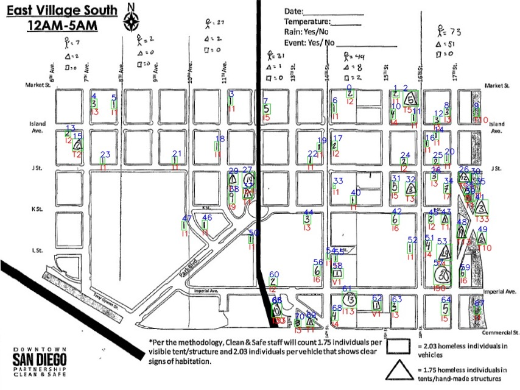
   
    Some observations:

    a. Bounding boxes around hand marked symbols are drawn in green
    b. Above each bounding box, the number in blue represents a sorted count ID (seen in spreadsheet
    below)
    c. Below each bounding box, there letter and number in red represent the type and the count of the
    hand marked symbol. I = Individual, T = Tent, V = Vehicle
    d. This image can be used for manual inspection and performance evaluation of the performance of
    the machine leaning models used
       i. Most of the bounding boxes have been identified correctly, but there are some false
          negatives and incorrect identifications
       ii. The “1” at the intersection of J and 15th St. was missed. This could be added manually
       iii. The 30 individuals at the intersection of Imperial and 17th St is misidentified as 50
          individuals. This could be corrected manually with inspection of each of the datasets. The
          map and IDs provide a natural way of doing it.

3. Below is a consolidated image for each month that takes the hand marked symbols and places
    them at the appropriate location on a map (created with the geopandas and contextily python
    libraries)

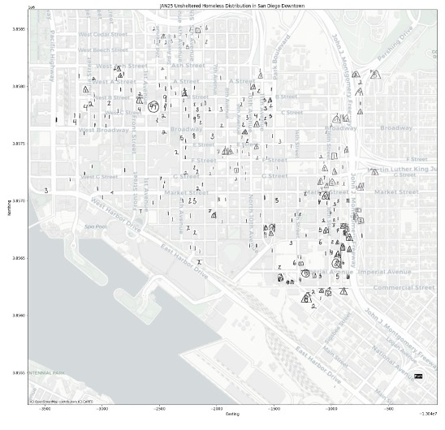

4. Below is a csv file created that consolidates data for all of the 10 regions into one file for one
    month into one file. This csv file is used to create ArcGIS maps.

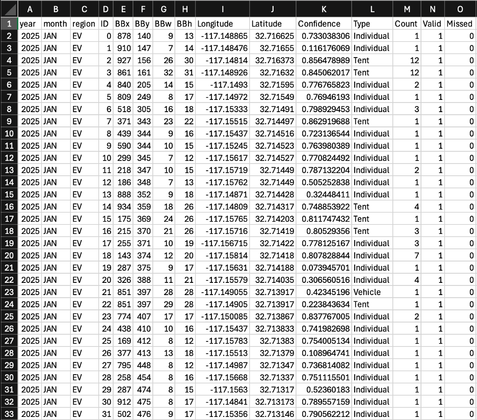

```
Year, Month: Date of data
Region: Location where data was collected
ID: Manual number associated with the count
BBx, BBy, BBw, BBh: Bounding box center pixel coordinates and dimensions
Longitude, Latitutde: Real world location of bounding box
Confidence: Likelihood of correct representation of the bounding box by the machine learning model
Type: Individual, Tent, Vehicle
Count: Number of individuals, tents, or vehicles
Valid: Flag that can be set to determine accuracy through manual inspection. Represents correct data
Missed: Flag that can be set to determine accuracy through manual inspection. Represents missed data
```

4. Using this csv file, we can create an ArcGIS map to visualize the data
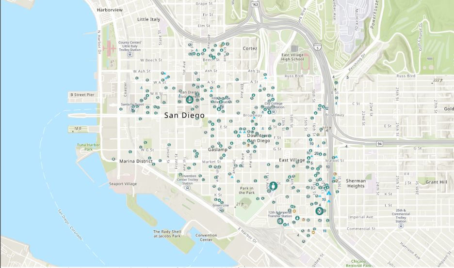

## 7. Conclusion

This project presents a fully automated, end-to-end pipeline for digitizing and georeferencing
observational DSDP homelessness survey data using a combination of deep learning, computer vision,
and geospatial analysis techniques. The system extracts hand-annotated count data from legacy paper
maps, classifies the observed entities into three semantic classes (Individual, Tent, Vehicle), and
transforms their image-space coordinates into real-world geographic coordinates using homography
matrices constructed from manually annotated ground control points (GCPs).

The approach leverages a modular machine learning architecture composed of six models, combining
object detection (YOLOv12-X) and classification (ViT-based) networks. These models, trained on over
20,000 manually labeled samples, demonstrate strong performance in accurately detecting and
interpreting symbolic annotations under varying imaging conditions and handwriting styles. The image
registration pipeline uses SIFT keypoint detection with Lowe’s ratio test and RANSAC-based
homography estimation for robust template-data alignment, enabling consistent geospatial
transformations across diverse map samples.

Post-processing routines convert pixel coordinates to WGS84 (EPSG:4326) geographic coordinates
using transformation matrices derived from annotated GCPs. The output includes structured CSV files
with spatial metadata, classification confidence scores, and validation flags, alongside visualization
artifacts generated using GeoPandas and contextily in Web Mercator (EPSG:3857) for cartographic
rendering. These outputs are further integrated into ArcGIS workflows to support longitudinal
spatiotemporal analysis of homelessness distributions.


Future development will focus on improving the end data quality by manual inspection and updating
the valid and missed columns within all the monthly csvs.


